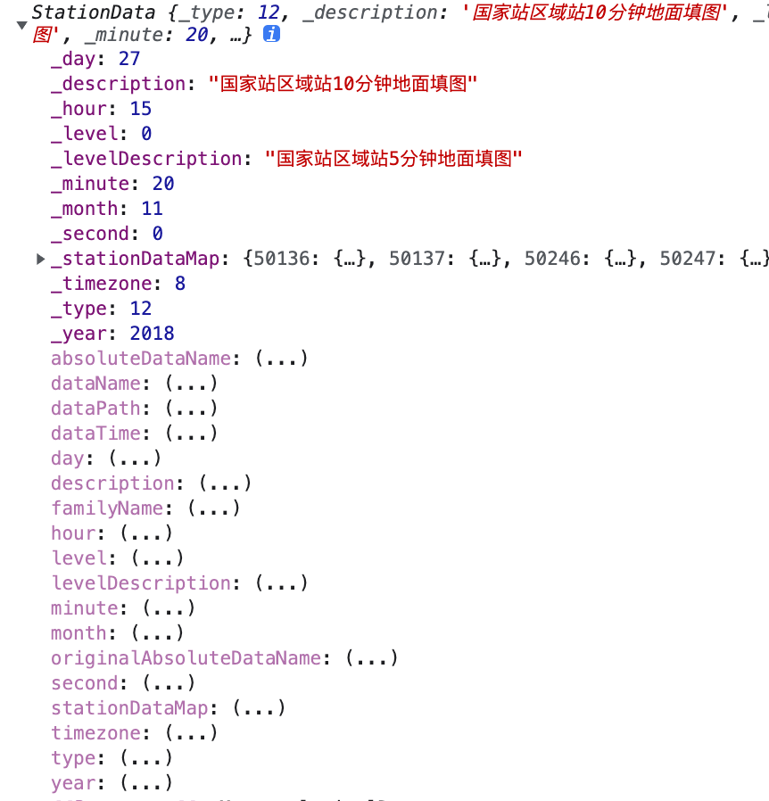
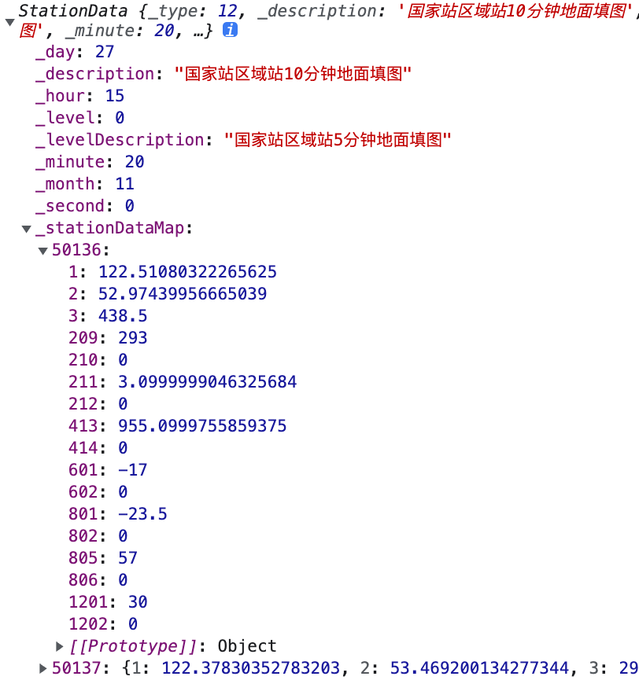
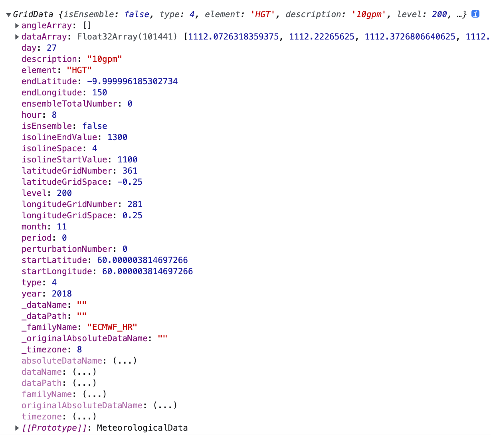
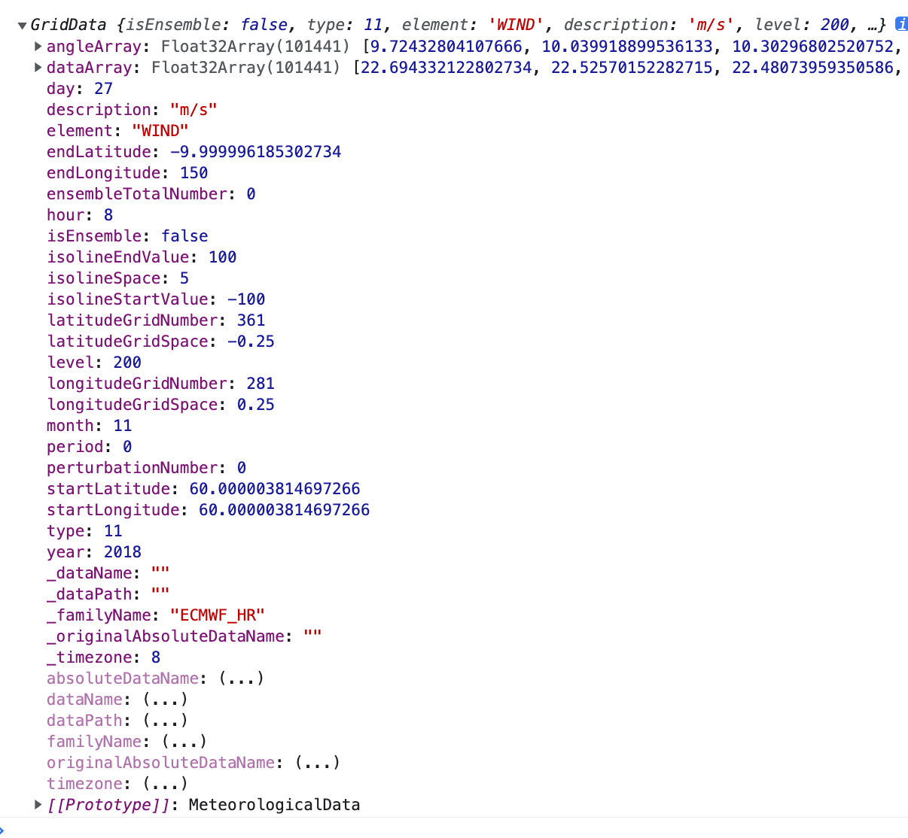

# 气象数据可视化
### *内部资料，请勿外传* 
## 1、数据采集
全国气象内网数据源主要有：`Micaps`、`CIMISS`、`SWAN`等。随着各地大数据平台的建设完善，也出现了更多的大数据云平台类的数据源，但是数据格式变化不大，仍以`Micaps`和`CIMISS`原来存储的数据格式为主。

`Micaps`经过将近20年的发展，格式从原来的十几种逐渐趋于统一；`CIMISS`主要是统一站点和文件型数据的存储结构，并没有定义新的文件格式，对于文件类的数据，如卫星云图一二级产品、天气雷达基数据和产品、数值模式等数据文件，还没有统一，仍需要熟悉各类产品的存储格式才能正确解析。

### 1.1、Micaps数据采集
使用`Node.js`开发，自动运行在后台运行的服务，进程管理采用`pm2`，采集核心功能由[Mesh3D.Data.Micaps.GDSClient](http://apps.mesh-3d.com/List/MeteoLib/doc/MeteoLib.Data.Micaps.GDSClient.html)提供。
#### 1.1.1、GDSClient服务参数设置
设置本地`Micaps`GDS服务IP和端口。各地服务器IP地址：
* 贵州：10.203.7.73
* 新疆：172.23.163.73
* 辽宁：10.86.26.153
```JavaScript
var GDSClient=MeteoLib.Data.Micaps.GDSClient;
GDSClient.config.gdsServerIp = "10.86.26.153";
GDSClient.config.gdsServerPort = "8080";
```
#### 1.1.2、创建GDSClient对象
```JavaScript
var gdsClient = new GDSClient({
    //1、在前端直接读取文件列表和获取文件数据，需要服务端代理，解决跨域问题
    //2、服务端采集不需要
    proxy: {
        getUrl: function (srcUrl) {
            return appConfig.DATASERVER_URL + "/proxy/" + srcUrl;
        }
    }
});
```

#### 1.1.3、获取文件列表
获取文件列表方法`getFileList`第一个参数为数据目录，各类产品数据目录参见[《docs/MICAPS4分布式数据库产品清单-省级201805.pdf》](http://apps.mesh-3d.com/List/MeteoLib/docs/micaps/MICAPS4分布式数据库产品清单-省级201805.pdf)。
```JavaScript
 gdsClient.getFileList("SATELLITE/FY2/L1/IR1/EQUAL").then(function(mapResult){
     //错误代码
    console.log(mapResult.errorCode);
    //错误信息
    console.log(mapResult.errorMessage);
    //文件列表：{fileName,fileSize}[]
    console.log(mapResult.data);
});
```
以示例中的目录为例：`SATELLITE/FY2/L1/IR1/EQUAL`
* `SATELLITE` 数据大类为卫星数据
* `FY2` 卫星名称为FY2
* `L1` 产品级别为一级
* `IR1` 通道为红外1
* `EQUAL` 投影方式为等经纬度投影

#### 1.1.4、获取最新时次数据文件名
```JavaScript
 gdsClient.getLatestDataName("ECMWF_HR/TMP/850", "*.024").then(function (strResult) {
    //打印文件名
    var fileName=strResult.data
    console.log(strResult.data)
})
```
#### 1.1.5、获取数据文件内容（二进制）
```JavaScript
var fileName= strResult.data;
gdsClient.getData("ECMWF_HR/TMP/850",fileName).then(function (bytesResult) {
    //保存文件到硬盘
    fs.writeFileSync(fileName,bytesResult.data)
})
```

## 2、数据解析

### 2.1、文件读取

#### 2.1.1、本地文件
读取通过`input`打开的本地文件，使用[MeteoLib.Util.FileSystem](http://apps.mesh-3d.com/List/MeteoLib/doc/MeteoLib.Util.FileSystem.html)。
##### 读取二进制
```js
const fs = new MeteoLib.Util.FileSystem();
var file = inputEl.file[0];
fs.readFile(file).then(buf => {
    //开始处理文件
})
```
##### 读取文本
```js
const fs = new MeteoLib.Util.FileSystem();
var file = inputEl.file[0];
fs.readFile(file,'text').then(text => {
    //开始处理文件
})
```
#### 2.1.2、网络文件
读取通过通过服务端发布的文件，使用[MeteoLib.Util.HttpFileSystem](http://apps.mesh-3d.com/List/MeteoLib/doc/MeteoLib.Util.HttpFileSystem.html)。
##### 设置服务参数
```js
var hfs = new MeteoLib.Util.HttpFileSystem({
    config: {
        baseUrl: '39.107.107.142:18880/hfs',
        auth: {
            uid: 'admin',
            pwd: 'Adnin@123456'
        }
    }
})
```
##### 获取文件夹列表
```js
hfs.getDirectoryList().then(function (dirList) {
    console.log(dirList);
})
```
##### 获取文件列表
```js
hfs.getFiles(dir,'SATELLITE/FY4A/L1/CHINA/C002').then(function (fileList) {
    console.log(fileList);
})
```
##### 获取文件下载链接
```js
var fileUrl = hfs.getFileUrl(fileList[0]);
```
##### 读取二进制
```js  
hfs.readFile(fileList[0]).then(buf => {
    //开始处理文件
})
```
##### 读取文本
```js
fs.readFile(fileList[0],'text').then(text => {
    //开始处理文件
})

```
### 2.2、Micaps站点数据解析
站点数据解析使用[MeteoLib.Data.Micaps.StationData](http://apps.mesh-3d.com/List/MeteoLib/doc/MeteoLib.Data.Micaps.StationData.html)。
```JavaScript
var fileUrl='./20181127152000.000'
var stationData = new MeteoLib.Data.Micaps.StationData()
if (stationData.loadByteArray(buf)) {
    console.log(stationData);
}
```

#### 2.2.1、整体数据结构


#### 2.2.2、站点数据结构



#### 2.2.3、站点数据编码
* 地理信息类1-200：
  * `1` 经度
  * `2` 纬度
  * `3` 测站高度
* 风向风速类201-400：
  * `209` 2分钟平均风向
  * `211` 2分钟平均风速
* 气压类401-600：
  * `413` 气压

详细参数解释及站点数据编码参见文档[MeteoLib.Data.Micaps.StationData](http://apps.mesh-3d.com/List/MeteoLib/doc/MeteoLib.Data.Micaps.StationData.html)。


### 2.3、Micaps格点数据解析
格点数据解析使用[MeteoLib.Data.Micaps.GridData](http://apps.mesh-3d.com/List/MeteoLib/doc/MeteoLib.Data.Micaps.GridData.html)。
```JavaScript
var fileUrl='./18112708.000'
var gridData = new MeteoLib.Data.Micaps.GridData()
if (gridData.loadByteArray(buf)) {
    console.log(gridData);
}
```
#### 2.3.1、数据结构

#### 2.3.1、数据结构（风场）

## 3、数据展示
### 3.1、色斑图绘制
核心功能由[MeteoLib.Render.RasterImageGenerator](http://apps.mesh-3d.com/List/MeteoLib/doc/MeteoLib.Render.RasterImageGenerator.html)提供，此类可以同时浏览器和`Node.js`环境运行。
```JavaScript
var rasterImageGenerator=new MeteoLib.Render.RasterImageGenerator({
    //调色板/图例
    colorMap:[
        [0.99, 9, [129, 195, 207, 200], "1-9mm"],
        [9.99, 24, [94, 98, 185, 200], "10-24mm"],
        [24.99, 49, [227, 90, 235, 200], "25-49mm"],
        [49.99, 99, [129, 116, 90, 200], "50-99mm"],
        [99.99, Number.MAX_VALUE, [241, 28, 76, 200], "≥100mm"]
    ]
})
//4*3格点数据
var data=[
    0,1,2,3
    4,5,6,7
    8,9,10,11
]
var width=4,height=3;
var canvas=rasterImageGenerator.generate(data,width,height)
```
### 3.2 基于文件的数据显示图层基础类：IHfsFileLayer
定义hfs文件数据图层接口，实现基本的加载流程。

#### 构造函数(`fileLoader`, `options`)
* `fileLoader`：文件加载器，统一管理文件列表刷新、文件读取
* `options`:文件数据元信息
    * `dir`: `string` 数据根目录名称，映射到服务端一个具体的物理路径。
    * `path`: `string` 数据目录相对于根目录的路径。 
    * `zIndex`: `number` 图层顺序，值最大表示图层处于最上层。
    * `ext`: `string` 可选。数据文件后缀。
    * `fromDb`:`boolean` 可选。true则从入库结果中查询，false则直接从文件系统中读取。
    * `timeRegex`: `string` 可选。文件名的时间格式，默认为“yyyyMMddhhmmss”。

#### 通用属性
* `fileList`: FileInfo[] `获取`文件列表
* `timeList`: Date[] `获取`时间列表
* `latestTime`: Date `获取`最新时次时间
* `currentTime`: Date `获取`或`设置`系统当前时间，通知更新图层
* `currentFile`: FileInfo 获取当前文件信息
* `ready`: boolean `获取`文件加载状态，true表示当前时次数据加载完成，false表示未加载或者加载中
* `options`: object 同构造函数中的options 
* `colorMap`: any[] `获取`当前图层所用的调色板对象，ready为false时返回undefined 
* `rectangle`: Cesium.Rectangle `获取`图层四至范围

#### 通用方法
* `updateList`(`startTime`, `endTime`): `Promise<this>` 更新文件列表，可以选择按指定时段查询，如未指定时段则查询全部
    * `startTime`：可选。时间对象或者字符串，查询时段的起始时间
    * `endTime`：可选。时间对象或者字符串，查询时段的结束时间
    * 返回值：返回一个异步操作对象
* `load`(`earth`): `Promise<this>` 加载图层，添加到地球对象图层列表，同时使得图层获取到地球对象，正式开始按默认参数加载文件列表。
#### 子类需要实现的方法和属性
* `channelPath` :默认值为`options.path`的值，可以在子类重写读写器，根据要素、层次等待返回最终的相对路径。
* `show`:可在子类中重写读写器，实现具体可视化图层对象（如ImageryLayer、Entity）等的显隐。
* `updateLayer(layer)`：子类中实现，加载应文件数据，可视化对象的创建、添加到场景功能。当`currentTime`改变时，自动调用此方法
* `unload(earth)`：子类中实现，卸载图层，释放文件数据，移除可视化对象等功能。
* `onError(err)`：可以在子类中实现，也可以在使用时实现，用于接收、处理内部产生的错误信息。
* `onListUpdate(layer)`：可以在子类中实现，也可以在使用时实现，当文件列表发生变化时，自动调用。

#### 应用示例
```JavaScript
var layer = new IHfsFileLayer(hfsLoader,{
    dir: 'GZData',
    path: "ECMWF_LR/TMP/850",
    ext: '*.000',
    timeRegex: 'yyyyMMddhh',
    zIndex: 4
})
layer.load(earth).then(() => {
    layer.currentTime = layer.latestTime;
})
```

### 3.3 数值模式图层: MicapsECLayer
* `element`:   要素
* `level`:   层次
* `forecastTime`:  预报时间
* `showIsoLine`: 是否显示等值线
* `fill`: 是否显示色斑图/填充颜色
* `interpolate`:true则色斑图基于插值结果数据集绘制（结果与等值线相吻合），false则使用原始数据绘制（原始分辨率较低，所以马赛克比较严重）
* `clipperLayer`:类型为`Vector2dLayer`，用于裁剪的矢量图层。矢量数据必须包含面要素，且样式开启填充颜色功能

### 3.4 卫星云图图层: SateCloudLayer
* `channel`: `云图通道`
    * 可见光：C002
    * 红外：C012
    * 水汽：C008 
    
### 3.5 PUP单站雷达产品图层: PUPRadarLayer
* `station`: 雷达站点名称
* `prodCode`: 产品代码
    * 组合反射率： `CR/38`
    * 回波顶高：`ET/41`
    * 液态含水量：`VIL/57` 

### 3.6 SWAN雷达拼图图层: SwanRadarLayer
* `levelCount`: 获取拼图总层数 
* `level`: 获取或设置层次索引

### 3.7 高空填图图层: MicapsUpAirLayer  
* `symbolSize`:符号图片大小，默认值为`80`
* `windSymbolType`: '  风向符号类型，默认为风羽/风向杆
    * `windShaft` ： 风羽
    * `arrow` ： 箭头 
* `windSymbolSize`:风向符号大小，默认为32

### 3.8 地面监测要素图层: SurfLayer
* `element`:   要素
    * 降水要素：
        * MAX_PRE_1h ：1小时最大降水量
        * PRE_1h ：1小时降水量
        * PRE_3h ：3小时降水量
        * PRE_6h ：6小时降水量
        * PRE_24h ：24小时降水量
    * 其他要素：
        * TEM ：气温
        * RHU ：相对湿度
 * `textField`: 标注文本所用的字段
    * 站号： `Station_Id_C`
    * 站名： `Station_Name`
 
* `showIsoLine`: 是否显示等值线
* `fill`: 是否显示色斑图/填充颜色 
* `showPoint`: 是否显示散点
* `showText`: 是否显示标注文本的附加部分，即站名或者站号部分
* `showValue`: 是否标注显示要素的数值
   
### 3.n 综合实例
#### 确认npm registry为公司私有节点
```shell
npm config get registry
```
结果输出如下信息则表明已经设置完成：
```log
http://registry.mesh-3d.com/
```
否则，进一步设置registry为公司私有节点：
```shell
npm config get registry http://registry.mesh-3d.com
```
切换节点后需要登录（会自动注册）：
```shell
npm login
```
输入用户名、邮箱、密码等完成登录或者注册。

#### npm安装依赖包：
```shell
npm i @mesh-3d/cesium
npm i @mesh-3d/meteolib-wdv
npm i @mesh-3d/weather-dv
npm i cesiumvectortile
```

#### html引用js文件：
```html
<script src="../node_modules/@mesh-3d/cesium/Build/Cesium/Cesium.js"></script> 
<script src="../node_modules/cesiumvectortile/dist/CesiumVectorTile.min.js"></script>
<script src="../node_modules/@mesh-3d/meteolib-wdv/dist/MeteoLib.min.js"></script> 
<script src="../node_modules/@mesh-3d/weather-dv/dist/WeatherDV.min.js"></script>
```

#### 创建可视化图层
```JavaScript
const {
    HfsFileLoader, SateCloudLayer,
    MicapsECLayer, PUPRadarLayer, 
    SwanRadarLayer,MicapsUpAirLayer,SurfLayer,
    Earth
} = WeatherDV;
  
const { RasterImageGenerator } = MeteoLib;
RasterImageGenerator.registerAll('../assets/pal/')

var viewer, awxLayer, earth;

var hfsLoader = new HfsFileLoader({
    baseUrl: 'http://39.107.107.142:18880/hfs',
    auth: {
        uid: 'admin',
        pwd: 'Adnin@123456'
    }
})

var mapContainer = document.getElementsByClassName('map-container')[0]

earth = new Earth({
    container: mapContainer,
    creditContainer: document.createElement('div'),
    timeline: true,
    animation: true,
    infoBox: false
})

//ec数值模式
var ecLayer = new MicapsECLayer(hfsLoader)
ecLayer.load(earth).then(() => {
    ecLayer.currentTime = ecLayer.latestTime;
})
//卫星云图
var sateLayer = new SateCloudLayer(hfsLoader)
sateLayer.load(earth).then(() => {
    sateLayer.currentTime = sateLayer.latestTime;
})
//pup单站雷达产品
var pupRadarLayer = new PUPRadarLayer(hfsLoader)
pupRadarLayer.load(earth).then(() => {
    pupRadarLayer.currentTime = pupRadarLayer.latestTime;
})
//雷达拼图
var swanRadarLayer = new SwanRadarLayer(hfsLoader)
swanRadarLayer.load(earth).then(() => {
    swanRadarLayer.currentTime = swanRadarLayer.latestTime;
})
//高空填图
var micapsUpAirLayer = new MicapsUpAirLayer(hfsLoader)
micapsUpAirLayer.load(earth).then(() => {
    micapsUpAirLayer.currentTime = micapsUpAirLayer.latestTime;
})
//地面监测
var surfLayer = new SurfLayer(new HfsFileLoader({
    baseUrl: 'http://192.168.0.8:18099/hfs',
    auth: {
        uid: 'admin',
        pwd: 'Adnin@123456'
    }
}))
surfLayer.load(earth).then(() => {
    surfLayer.currentTime = surfLayer.latestTime;
})
```